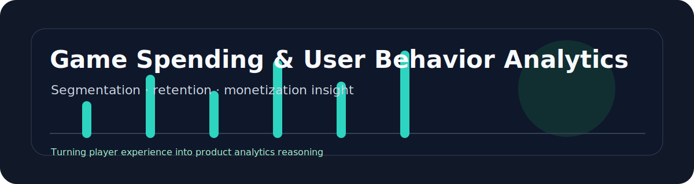

<p align="center">
  
</p>

<p align="center">
  
  
  
</p>

# Game Spending & User Behavior Analytics

A product analytics case study on gaming user behavior, spending motivation, retention signals, and monetization design.

## At a Glance

| Item | Detail |
| --- | --- |
| Role fit | Product analyst, AI operations, consumer app product roles |
| Core value | Converts gaming experience into measurable user and monetization insight |
| Main skills | User segmentation, retention proxy design, spending motivation analysis |
| Recruiter signal | Strong product sense for digital entertainment and live-ops systems |

## Project Background

As a long-time player of games such as Honor of Kings, Counter-Strike, Naraka: Bladepoint, and Hearthstone, I wanted to turn personal product experience into a structured analytics project. Instead of only describing opinions, this project frames gaming behavior through data analytics and product management concepts.

## Problem I Solved

Game companies need to understand why users return, what motivates spending, and which product features create long-term engagement. This project builds a lightweight analytics framework for segmenting players and interpreting monetization behavior.

## Tools & Tech Stack

- Excel / Google Sheets for behavior logs and cohort tables.
- Python for data cleaning and exploratory analysis.
- Power BI concept dashboard for retention and spending views.
- Markdown for product analysis and recommendations.

## Core Features

- Player behavior taxonomy.
- Spending motivation classification.
- RFM-style user segmentation.
- Retention and engagement metric design.
- Monetization feature analysis.
- Product recommendations for live-ops campaigns.

## Project Highlights

- Connects user psychology with measurable product metrics.
- Uses anonymized or synthetic records instead of exposing private spending data.
- Compares multiple game genres to identify common monetization patterns.
- Translates analysis into product decisions, not only charts.

## Data / AI / Product Thinking

- Data analytics: segmentation, frequency analysis, purchase motivation labels, retention proxy metrics.
- Product thinking: identifies how battle passes, skins, events, and ranked systems affect engagement.
- AI workflow: uses AI to structure hypotheses, generate analysis templates, and refine insight writing.

## Outcome

The project demonstrates how gaming experience can be converted into product analytics insight, especially for AI product, operations, and data analytics roles in consumer apps or digital entertainment.

## Repository Structure

```text
game-spending-user-behavior-analytics/
├── README.md
├── data/
│   └── sample_behavior_log.csv
├── notebooks/
├── reports/
│   └── case-study.md
├── dashboard/
├── assets/
└── docs/
    └── metric-framework.md
```

## Resume Bullet

- Developed a gaming product analytics case study using user segmentation, spending motivation analysis, and retention metric design to translate player behavior into monetization and live-ops recommendations.
